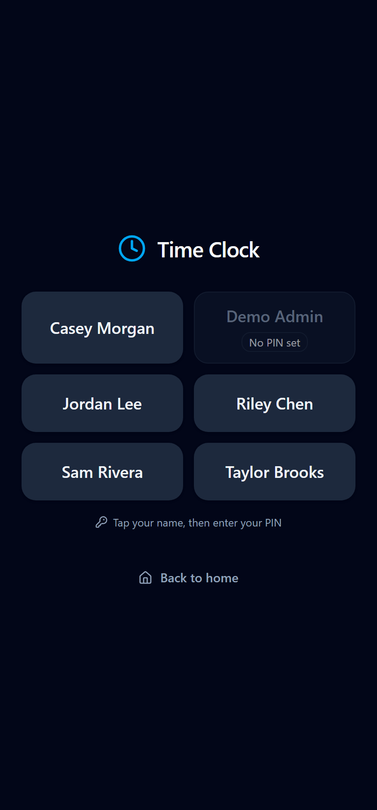
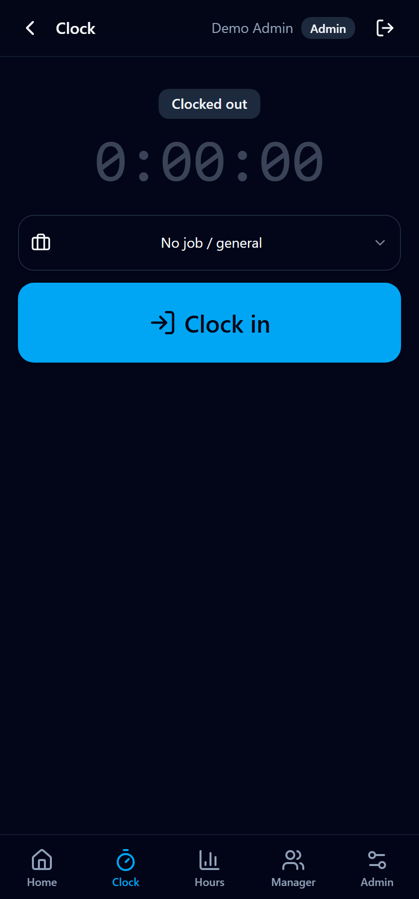
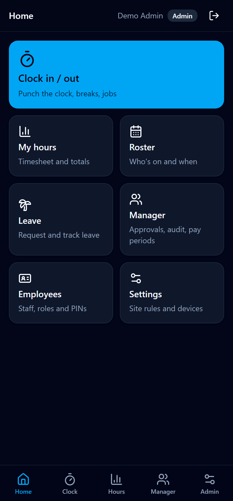
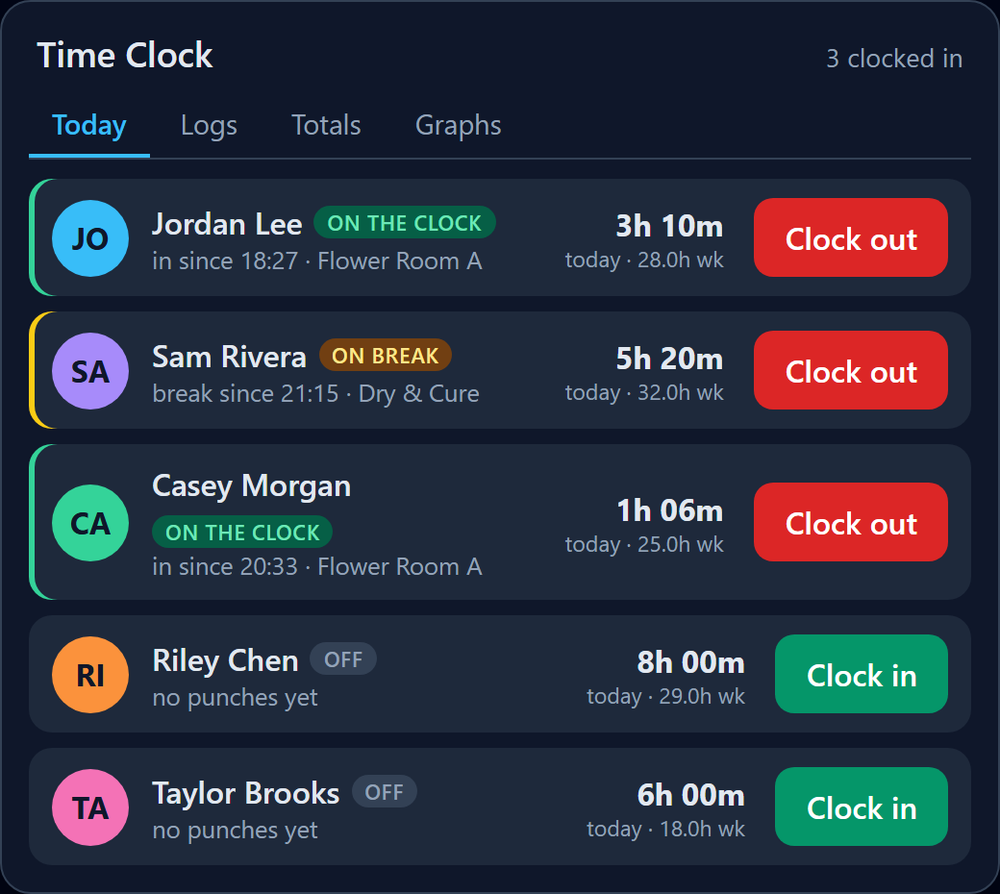
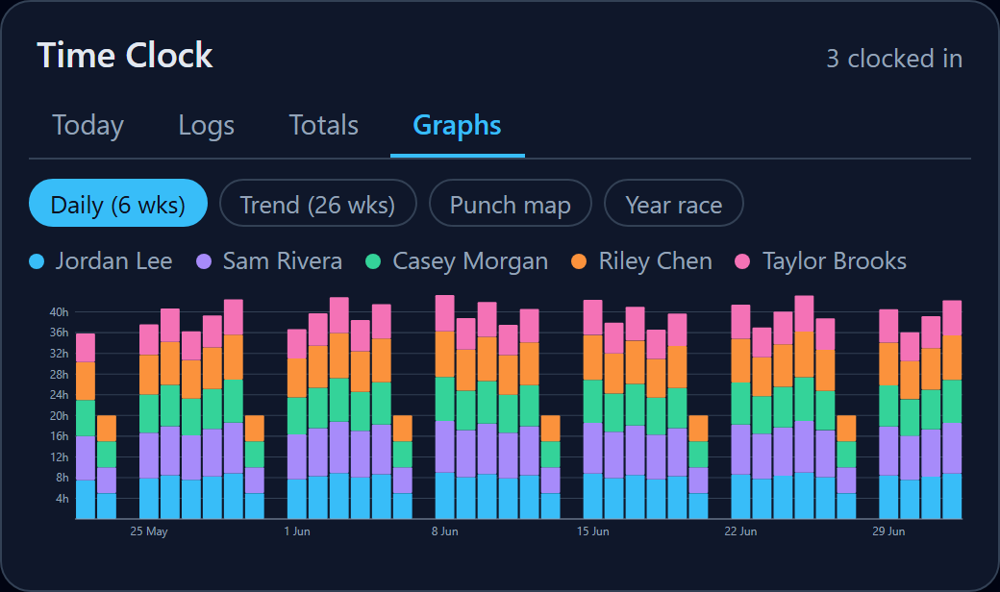
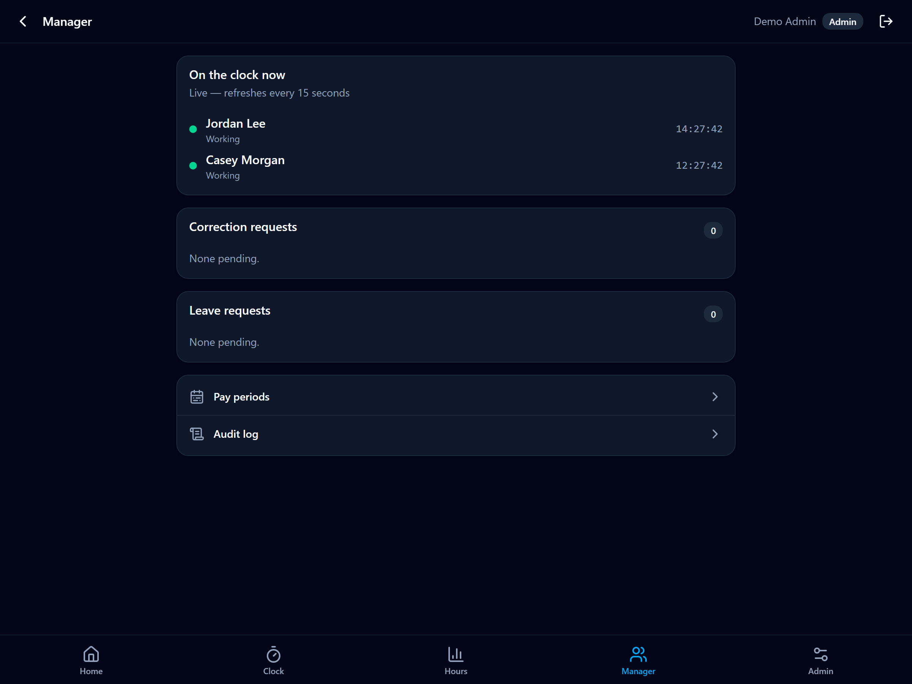

# Time Clock for Home Assistant

Employee time clock that runs as a Home Assistant add-on. Staff clock in and out
from a shared kiosk tablet, from their phone, or straight from the Home Assistant
sidebar. Every punch lands in an append-only, hash-chained audit log that cannot
be edited or deleted after the fact.

Built for a working site, not a demo. It runs a real payroll pre-run against New
Zealand rules, bundles its own PostgreSQL, and ships a dashboard card plus
companion-app widgets so the whole thing lives inside Home Assistant.

### ▶ [Try the live demo](https://jaketherabbit.github.io/ha-timeclock/)

Explore the whole app in your browser — no install, no Home Assistant needed.
It runs on in-browser sample data (fake staff, punches, breaks, corrections,
leave, rosters), so you can clock in and out, approve requests, and browse every
screen. Data resets on reload. Themed to look native in Home Assistant, with a
dark/light toggle and accent picker.

---

## Screenshots

| Kiosk sign-in | Clock in / out | Home |
| --- | --- | --- |
|  |  |  |

| Dashboard card | Graphs | Manager board |
| --- | --- | --- |
|  |  |  |

More in [screenshots/](screenshots/): logs, totals, roster, leave, pay periods,
audit viewer, and the admin screens.

---

## What it does

Three ways to clock, one record behind them:

- **Kiosk.** A shared tablet on the wall. Tap your name, enter your PIN, clock in.
- **Home Assistant login.** Open the sidebar panel and you are signed in as
  whoever you are logged into Home Assistant as. No second password.
- **Phone.** A companion-app widget on the home screen. One tap in or out. An
  optional reminder fires when you arrive on the work network and when you leave.

Every punch is immutable. `time_entries` holds the current truth; `audit_log` is
append-only and protected three ways: the runtime connects as a database role
with no permission to update or delete audit rows, triggers reject any attempt
even from a superuser, and a SHA-256 hash chain makes tampering evident. Staff
can correct their own times, but a correction writes a new value plus an audit
row with the reason. Nothing is ever erased.

## Features

Clocking
- PIN kiosk, Home Assistant single sign-on, and phone widgets
- Paid and unpaid breaks, with an auto-deducted meal break on long shifts
- Job and project switching for job costing
- Live shift timer
- Offline punch queue: the kiosk keeps working through a Wi-Fi drop and replays
  the punches when it reconnects, flagged for review

Audit and corrections
- Append-only, hash-chained audit log with live chain verification
- Self-service edits that require a reason and stay flagged forever
- Correction requests with a manager approval queue

Localization
- Country presets: New Zealand, USA, UK, Ireland, Canada, Australia, Germany,
  France, Switzerland, Sweden, Denmark. Pick one to set week start, currency,
  date/number format, timezone, and a starting overtime rule (all editable)
- Public holidays per country and region (state, province, canton, nation)
- Locale-aware dates, times, numbers, and currency
- UI language packs: English, German, French, Swedish, Danish (English fallback)
- Tracks hours and exports them; it does not calculate income tax (that is your
  payroll system's job)

Payroll rules
- Overtime engine (daily and weekly thresholds, configurable multipliers)
- Punch rounding policies (report time only, raw punches never change)
- New Zealand: computed public holidays with Mondayisation and Matariki,
  statutory-day time and a half, alternative-holiday assessment, and Employment
  Relations Act break-compliance flags

Rostering and leave
- Shifts, scheduled versus actual, late and no-show detection
- Leave requests and approvals, ledger balances, 4/52 annual-leave accrual

Manager and reporting
- Live who-is-in board
- Pay-period sign-off and lock (locked periods are immutable)
- Timesheet CSV and PDF, payroll CSV export (Xero and iPayroll adapters stubbed)

Home Assistant integration
- `sensor.timeclock_summary` and per-employee sensors, pushed on every punch
- A custom dashboard card (`custom:timeclock-card`): live status, one-tap clock
  in and out, logs, week/month/quarter/year totals, and graphs
- Android companion-app widgets to clock in and out from a phone
- Presence reminders that notify a person to clock in when they reach the work
  network and to clock out when they leave (notify only, never auto-punches)
- One-click install writes the package YAML and the card into your config

Safety and operations
- Anti-fraud controls: geofence, IP allowlist, photo on punch, kiosk device
  binding, PIN rate limiting (each is flag-only or enforced)
- Home Assistant notifications, an auto-clockout safety net, daily database
  backups with restore verification
- Bundled PostgreSQL 16 on the add-on's persisted volume

## Install

1. Add this repository to Home Assistant. Use the button above, or go to
   Settings, Add-ons, Add-on Store, the three-dot menu, Repositories, and paste
   `https://github.com/JakeTheRabbit/ha-timeclock`.
2. Install **Time Clock** from the store.
3. Start it, then open the panel from the sidebar.

Requires Home Assistant OS or Supervised (add-ons need the Supervisor).
Architectures: amd64 and aarch64.

## First run

1. Open the panel and tap **First-time setup: claim admin**. The first Home
   Assistant user to do this becomes the Admin.
2. Go to Admin, Employees. Add your staff. Set a PIN for anyone who will use the
   kiosk, and set each person's Home Assistant username so their login signs them
   in automatically.
3. Go to Admin, Settings. Set the overtime, rounding, pay-period anchor, and
   anything else for your site.
4. Optional: Admin, Settings, Home Assistant integration, Install. This adds the
   dashboard card and the widget scripts.

Full walkthrough in the [Admin and Manager guide](docs/admin-guide.md). The
short version for staff is in the [Employee guide](docs/employee-guide.md).

## Documentation

- [Admin and Manager guide](docs/admin-guide.md): setup, payroll rules, the
  dashboard card, presence reminders, pay-period sign-off, troubleshooting.
- [Employee guide](docs/employee-guide.md): clocking in and out, breaks, fixing a
  time, the phone widget.
- [Add-on documentation](timeclock/DOCS.md): configuration options, sensors, and
  how the ingress routing works. This is also the Documentation tab inside Home
  Assistant.
- [Changelog](timeclock/CHANGELOG.md).

## How it is built

Next.js 15 (App Router) with a Hono API, Drizzle ORM, and a bundled PostgreSQL
16, packaged as an s6-overlay add-on. Served through Home Assistant Ingress on
the local network. Timezone defaults to Pacific/Auckland. The test suite runs
against a real PostgreSQL, including a proof that raw SQL cannot mutate the audit
log.

## Contributing

Issues and pull requests are welcome. See [CONTRIBUTING.md](CONTRIBUTING.md) for
how to run the webapp locally and what the checks expect. Security reports go
through [SECURITY.md](SECURITY.md), not public issues.

## License

MIT. See [LICENSE](LICENSE).

This is a community add-on and is not affiliated with or endorsed by Home
Assistant or Nabu Casa. The payroll logic follows New Zealand rules but is a
pre-run to help you, not certified payroll software. Check the numbers before you
pay anyone off them.
