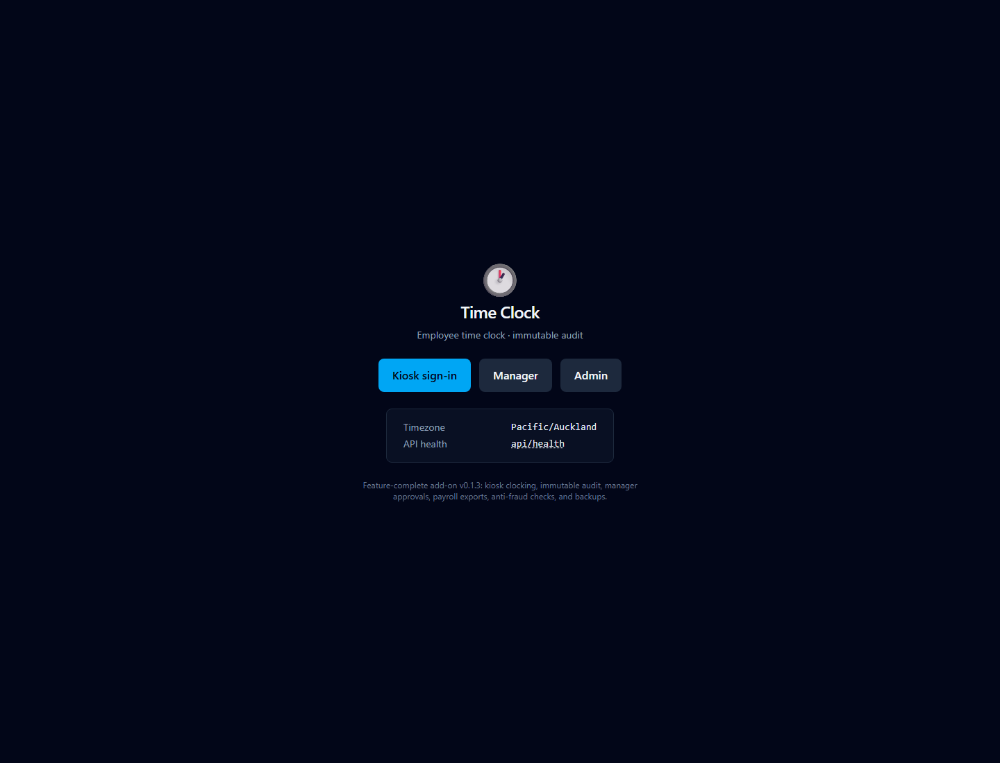

# Time Clock — Home Assistant add-on

A full-featured employee time-clock system that runs as a Home Assistant add-on,
reached through the HA sidebar (Ingress) on the local network. Kiosk-first: a
shared wall tablet with per-employee PIN + device binding.

**Design pillar — immutable audit.** `time_entries` holds the mutable current
truth; `audit_log` is append-only, protected by (1) app-layer INSERT-only
writes, (2) Postgres triggers that raise on UPDATE/DELETE, and (3) a SHA-256
hash-chain that makes any tampering evident. Staff can edit their own times, but
every edit writes a new value plus an audit row (old→new + reason). Deletion is
impossible.

## Stack

Next.js 15 (App Router) · shadcn/ui · Tailwind v4 · TanStack Query · React Hook
Form + Zod · Hono API · **PostgreSQL 16 bundled inside the add-on** · Drizzle ORM
· node-cron. Timezone `Pacific/Auckland`.

## Repository layout

```
repository.yaml          HA add-on repository manifest
timeclock/               the add-on (slug: timeclock)
  config.yaml            add-on manifest (ingress, panel, apis)
  build.yaml             per-arch base image
  Dockerfile             multi-stage: build Next standalone → HA base runtime
  rootfs/                s6-overlay v3 services (postgres → migrate → app → ingress)
  webapp/                Next.js 15 project (App Router + Hono API + Drizzle)
```

## Install (as an add-on repository)

Settings → Add-ons → Add-on Store → ⋮ → Repositories → add this repo URL, then
install **Time Clock**.

## Build phases

P0 scaffold · P1 DB + audit immutability · P2 auth/RBAC/kiosk · P3 clock/breaks ·
P4 edits/corrections · P5 overtime + NZ holidays + rounding · P6 rostering ·
P7 leave · P8 manager dashboard + pay-period lock · P9 reports/export ·
P10 notifications · P11 anti-fraud · P12 polish.

**Current:** v0.1.3 — feature-complete through P12, with first-boot admin
claim, HA Ingress routing, bundled Postgres, migrations, and CI coverage.

## Screenshots



## Feature list

- Kiosk PIN sign-in with device binding, clock in/out, paid and unpaid breaks,
  job switching, live timers, and offline punch replay.
- Immutable audit model with append-only `audit_log`, Postgres trigger guards,
  role-limited writes, and SHA-256 hash-chain verification.
- Staff self-corrections with mandatory reasons, manager correction queues, and
  permanent edited flags.
- NZ payroll rules: overtime, rounding, public holidays including Matariki and
  Mondayisation, stat-day pay, alternative holidays, and ERA break flags.
- Rostering with scheduled-vs-actual views, late/no-show detection, leave
  requests, approvals, ledger balances, and annual-leave accrual.
- Manager dashboard with live who's-in board, pay-period materialization,
  sign-off, immutable lock, admin unlock with reason, and audit viewer.
- Reports and exports: day-level CSV, PDF summary, generic payroll CSV, and
  Xero/iPayroll adapter stubs.
- Notifications and maintenance: HA `notify.*`, SMTP interface, auto-clockout,
  daily `pg_dump` backups, restore verification, and weekly accrual cron.
- Anti-fraud controls: geofence, CIDR/IP allowlist, photo-on-punch, device
  binding, PIN rate limiting, and punch forensics.

## To do

- Replace Xero and iPayroll stubs with real API integrations.
- Finish SMTP credential handling and production email templates.
- Add end-to-end browser coverage for the HA Ingress panel and kiosk flows.
- Add release automation for packaged Home Assistant add-on builds.
- Expand screenshot coverage with seeded demo data for kiosk, manager, and
  reports once a demo fixture is available.
